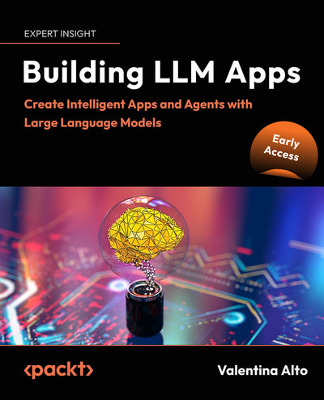
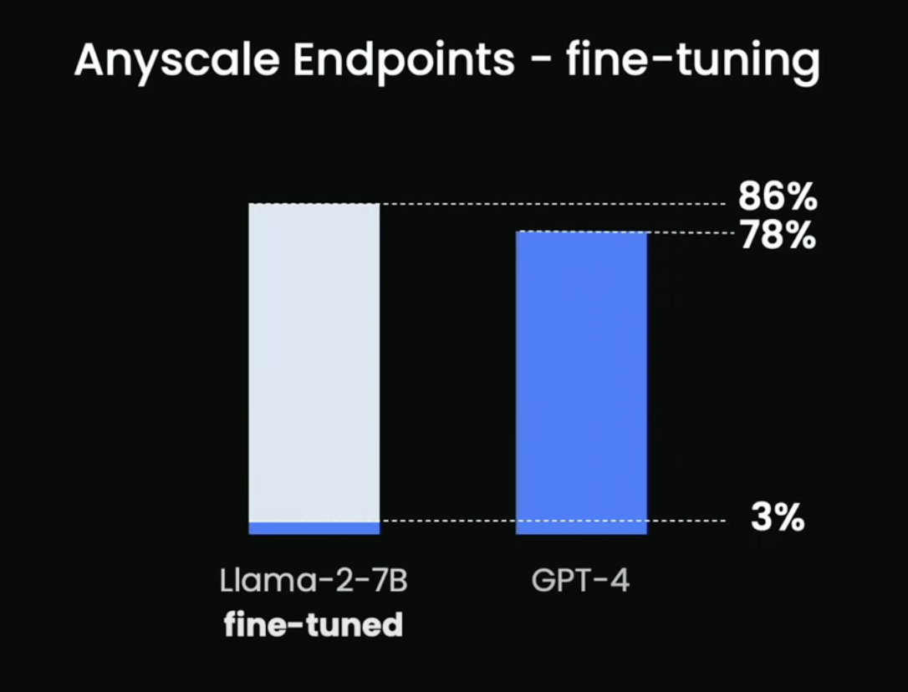
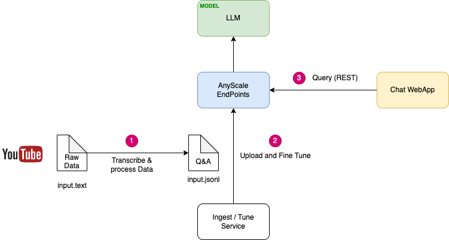
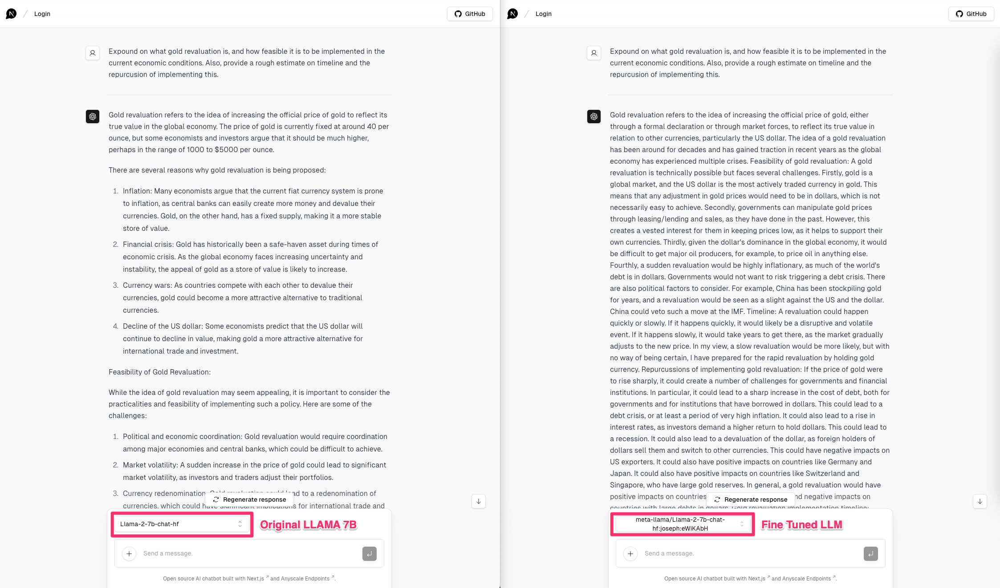
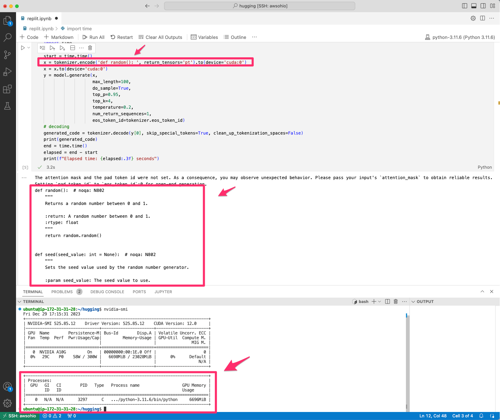
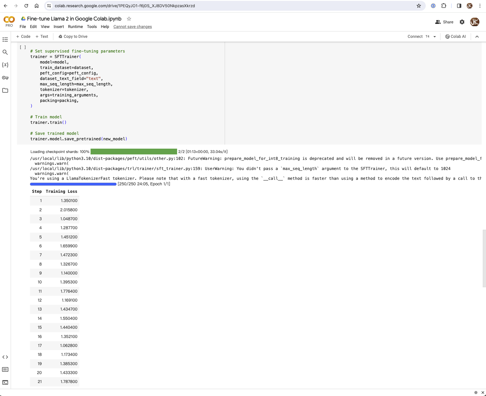
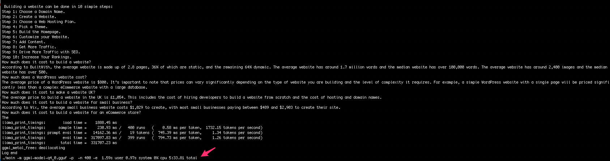
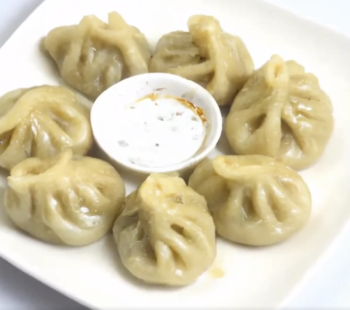
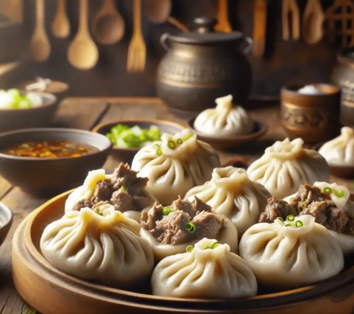

# LabWeek 2023

Having no previous background in ML, looked forward to the opportunity on spending a "LabWeek" in this area.  The main goal is to gain exposure to the following specific fields:

- [X] Large Language Model (LLM) (Demo: https://llm.kiok.org/)
- [X] Image Generation and Text to Speech (Demo: https://twitter.com/AsianFoodDaily)

----

## &raquo; Project: MacroLLM (Large Language Model)

The goal of this project is to explore how LLMs work in general (tuning, inference, and estimated execution time for different GPU).

### Key Findings
* Open source LLMs exists: [Llama](https://github.com/facebookresearch/llama), [Falcon](https://falconllm.tii.ae/), [MPT](https://www.mosaicml.com/)
* LLM workflow primarily includes [preprocessing and inferencing](https://blog.replit.com/llm-training)
* Inference optimization can be improved by using [Triton Inference Server](https://docs.nvidia.com/deeplearning/triton-inference-server/user-guide/docs/user_guide/optimization.html)
* Fine tuning smaller model (Llama-2-7B) is [better than larger model (GPT-4)](https://youtu.be/r-NYSeAXCko?t=851)
* LLM performance metrics is based on [time to first token, inter-token latency, and success rate](https://www.anyscale.com/blog/comparing-llm-performance-introducing-the-open-source-leaderboard-for-llm)

 

### Architecture

### Demo

Demo URL: https://llm.kiok.org/ (requires AnyScale API Key)

Summary:  Fine tune the [Llama-2 7B](https://huggingface.co/meta-llama/Llama-2-7b) LLM with data from [Luke Gromen](https://twitter.com/LukeGromen) - a macro economists with over 20+ years of experience.

### Iterations
| | |
|-|-|
| *Iteration 1*: Inference (VM with GPU)   Reference: https://huggingface.co/replit/replit-code-v1_5-3b   This exercise was to test inference using Replit 1.5 Model.  The unexpected complexity here was that it [did not support the T4 GPU](https://github.com/microsoft/DeepSpeed/issues/2001) (which came with [AWS G4](https://aws.amazon.com/ec2/instance-types/g4/)), and had to request for [AWS G5](https://aws.amazon.com/ec2/instance-types/g5/) which came with [A10G GPU](https://www.nvidia.com/en-us/data-center/products/a10-gpu/). |  |
| *Iteration 2*: Fine Tuning (Google Colab PRO - Using A100, V100, T4)   Reference: https://towardsdatascience.com/fine-tune-your-own-llama-2-model-in-a-colab-notebook-df9823a04a32|  |
| *Iteration 3*: llama.cpp  Experiment what the execution time for no-GPU execution. | |

----

## &raquo; Project: Asian Food Daily (Image Generation and Text-to-Speech)

Demo URL: https://twitter.com/AsianFoodDaily

The goal of this project is to explore OpenAI's [Image Generation](https://platform.openai.com/docs/guides/images?context=node) and [Text to Speech](https://platform.openai.com/docs/guides/text-to-speech) capabilities.  Project was built using: Python, OpenAI APIs, [Ffmpeg](https://ffmpeg.org/), [Docker](https://www.docker.com/), [Twitter](https://www.twitter.com), and [Github Actions](https://github.com/features/actions) (for scheduled execution).

### Architecture

### Developer Notes

[DALL-E 2](https://openai.com/dall-e-2) seems to have significant improvement to that of [DALL-E 3](https://openai.com/dall-e-3), notice the additional details in the background.

| DALL-E 2                                         | DALL-E 3                                         |
|:-------------------------------------------------|:-------------------------------------------------|
|  |  |
